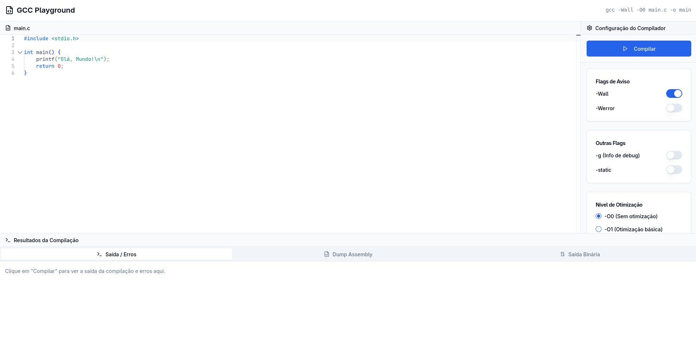

# 🧑‍💻 GCC Playground

Um playground moderno de compilador C baseado em tecnologias web, construído com Node, React, TypeScript e o Monaco Editor, feito como projeto final da disciplina PCS3732 - Laboratório de Processadores da Escola Politécnica da Universidade de São Paulo. Escreva, compile e analise código C com destaque de sintaxe em tempo real e ferramentas de desenvolvimento profissionais.



## Funcionalidades

### **Editor de Código Moderno**

- **Integração com Monaco Editor**: O mesmo editor poderoso usado no VS Code
- **Destaque de Sintaxe C**: Destaque completo de sintaxe com tema personalizado
- **IntelliSense**: Auto-completar e sugestões de código
- **Recursos Inteligentes**: Fechamento automático de parênteses, indentação inteligente, correspondência de parênteses

### **Configuração do Compilador**

- **Flags do GCC**: Alterne flags comuns do compilador (-Wall, -Werror, -g, -static)
- **Níveis de Otimização**: Escolha entre O0, O1, O2, O3, Os, Ofast
- **Comando em Tempo Real**: Veja o comando GCC gerado no cabeçalho

### **Saída Multi-Painel**

- **Saída de Compilação**: Mensagens de sucesso/erro
- **Dump Assembly**: Dump assembly do arquivo-objeto
- **Saída Binária**: Dump do binário compilado
- **Tratamento de Erros**: Feedback claro para falhas de compilação

## Front-end

### Estrutura

```
src/
├── components/         # Componentes React
│   ├── ui/             # Componentes shadcn/ui
│   └── code-editor.tsx # Wrapper do Monaco Editor
├── lib/                # Utilitários e helpers
│   ├── constants.ts    # Template padrão de código C
│   ├── mockData.ts     # Resultados de compilação simulados
│   ├── monacoTheme.ts  # Tema personalizado do Monaco Editor
│   └── utils.ts        # Funções utilitárias
├── types/              # Definições de tipos TypeScript
│   └── index.ts        # Interfaces compartilhadas
├── App.tsx             # Componente principal da aplicação
├── main.tsx            # Ponto de entrada da aplicação
└── index.css           # Estilos globais e variáveis CSS
```

### Tecnologias Utilizadas

#### Framework Principal

- **React 18** - React moderno com hooks
- **TypeScript** - JavaScript com segurança de tipos
- **Vite** - Ferramenta de build rápida e servidor de dev

#### UI e Estilização

- **Tailwind CSS** - Framework CSS utility-first
- **shadcn/ui** - Componentes React de alta qualidade
- **Lucide React** - Ícones SVG

#### Editor de Código

- **Monaco Editor** - Editor do VS Code no navegador
- **Tema Personalizado** - Integrado com o nosso design-system

### Scripts Disponíveis

- `npm run dev` - Iniciar servidor de desenvolvimento
- `npm run build` - Construir para produção
- `npm run preview` - Visualizar build de produção

_Lembre-se de instalar as dependências com `npm install` antes de iniciar o projeto pela primeira vez!_

## Back-end

### Estrutura

```
src/
├── server.js           # Servidor Express principal
├── services/
│   └── compiler.js     # Serviço de compilação GCC
└── middleware/
    ├── validation.js   # Validação de requisições
    └── errorHandler.js # Tratamento de erros
```

### Tecnologias Utilizadas

#### Framework e Servidor
- **Express.js** - Framework web para Node.js
- **CORS** - Middleware para Cross-Origin Resource Sharing
- **Helmet** - Middleware de segurança
- **Morgan** - Logger de requisições HTTP

#### Compilação e Análise
- **Child Process** - Execução de comandos GCC
- **File System** - Operações de arquivo para código temporário
- **UUID** - Geração de IDs únicos para sessões

#### Segurança e Validação
- **Express Rate Limit** - Limitação de taxa de requisições
- **Validação Customizada** - Validação de entrada de dados
- **Error Handling** - Tratamento abrangente de erros

### Scripts Disponíveis

- `npm run dev` - Iniciar servidor de desenvolvimento com nodemon
- `npm start` - Iniciar servidor de produção
- `npm test` - Executar testes unitários

### Pré-requisitos

- **Node.js** 18+
- **GCC** (GNU Compiler Collection) instalado e disponível no PATH
- **objdump** e **hexdump** (geralmente incluídos com GCC)

### Instalação e Execução

1. Navegue para o diretório backend:
```bash
cd backend
```

2. Instale as dependências:
```bash
npm install
```

3. Inicie o servidor de desenvolvimento:
```bash
npm run dev
```

O servidor iniciará em `http://localhost:3001`

### Pré-requisitos do Sistema

- **Node.js** 18+
- **GCC** (GNU Compiler Collection) instalado e disponível no PATH
- **objdump** e **hexdump** (geralmente incluídos com GCC)

#### Instalando GCC

**Ubuntu/Debian:**
```bash
sudo apt update
sudo apt install build-essential
```

**macOS:**
```bash
xcode-select --install
```

**Windows:**
- Instale MinGW-w64 ou use WSL
- Certifique-se de que GCC está no PATH do sistema

### Recursos de Segurança

- **Helmet**: Headers de segurança
- **CORS**: Configuração de Cross-Origin Resource Sharing
- **Rate Limiting**: 100 requisições por 15 minutos por IP
- **Validação de Entrada**: Validação de dados de entrada
- **Error Handling**: Respostas de erro abrangentes

### Tratamento de Erros

A API retorna códigos de status HTTP apropriados e mensagens de erro:

- `400` - Bad Request (erros de validação)
- `404` - Not Found
- `408` - Request Timeout
- `500` - Internal Server Error

### Variáveis de Ambiente

- `PORT` - Porta do servidor (padrão: 3001)
- `NODE_ENV` - Ambiente (development/production)

### Implantação em Produção

1. Configure as variáveis de ambiente:
```bash
export NODE_ENV=production
export PORT=3001
```

2. Instale as dependências:
```bash
npm install --production
```

3. Inicie o servidor:
```bash
npm start
```

### Solução de Problemas

**GCC Não Encontrado**
Certifique-se de que GCC está instalado e disponível no PATH do sistema:
```bash
gcc --version
```

**Erros de Permissão**
Certifique-se de que a aplicação tem permissões de escrita para o diretório temp.

**Timeouts de Compilação**
Arquivos de código grandes ou compilações complexas podem causar timeout. Considere implementar um mecanismo de timeout para uso em produção.

### Endpoints da API

#### Health Check
```
GET /api/health
```

#### Compilar Código
```
POST /api/compile
```

**Corpo da Requisição:**
```json
{
  "code": "#include <stdio.h>\n\nint main() {\n    printf(\"Hello, World!\\n\");\n    return 0;\n}",
  "flags": {
    "wall": true,
    "werror": false,
    "debug": false,
    "static": false,
    "optimization": "O0"
  }
}
```

**Resposta:**
```json
{
  "success": true,
  "output": "Compilation successful",
  "assembly": "Disassembly of section .text:\n\n0000000000001149 <main>:\n    1149:	f3 0f 1e fa          	endbr64 \n    114d:	55                   	push   %rbp\n    ...",
  "binary": "7f454c46020101000000000000000000030003e000000000000000000000000000\n4000000000000000980800000000000000000000400038000d0040001c001b000600\n..."
}
```

## Contribuindo

1. Faça um fork do repositório
2. Crie sua branch de feature (`git checkout -b feature/funcionalidade-incrivel`)
3. Faça commit das suas mudanças (`git commit -m 'Adiciona funcionalidade incrível'`)
4. Faça push para a branch (`git push origin feature/funcionalidade-incrivel`)
5. Abra um Pull Request

## Licença

Este projeto está licenciado sob a Licença GPL-3, veja o arquivo [LICENSE](LICENSE) para detalhes.
